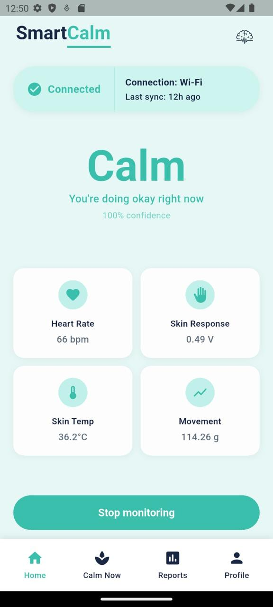
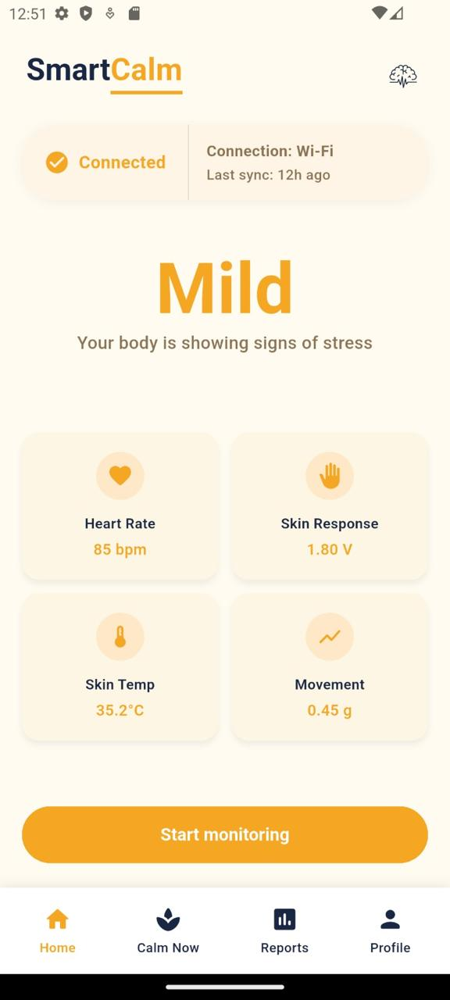
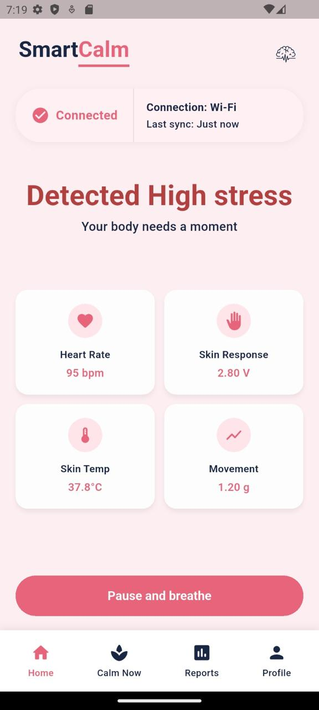
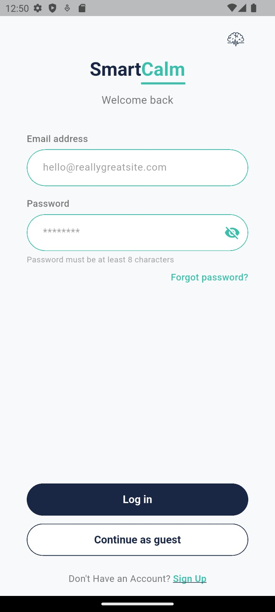
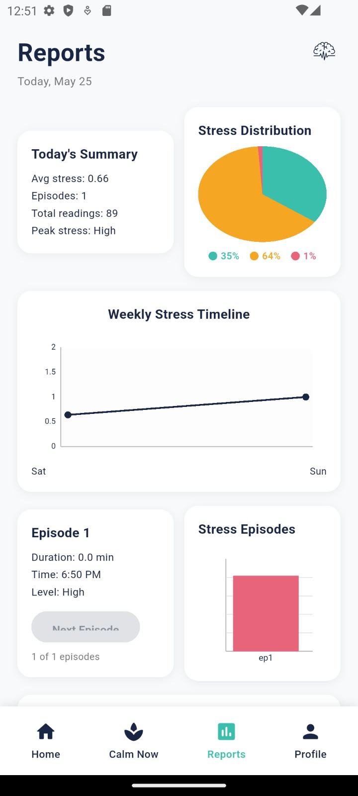
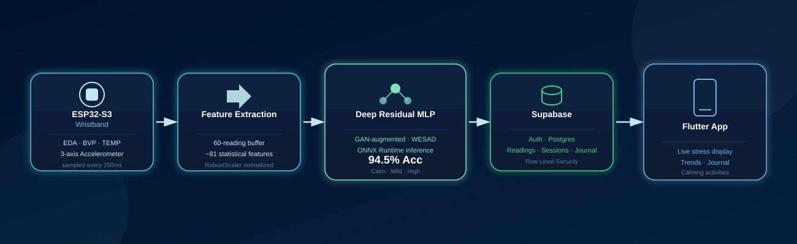
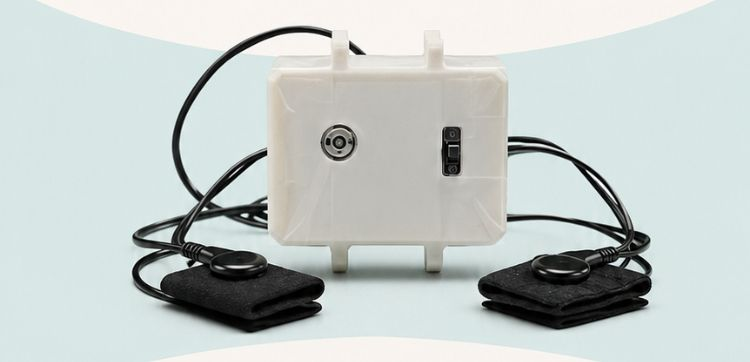

# SmartCalm

    

A real-time wearable stress detection system. A custom ESP32-S3 wristband streams physiological signals (EDA, BVP, skin temperature, and motion) to a trained Deep Residual MLP model, which classifies stress into **Calm**, **Mild**, or **High** and delivers live feedback through a companion mobile app.

Developed as a graduation capstone project — Artificial Intelligence Department, King Abdullah II School of Information Technology (KASIT), University of Jordan, under the supervision of Dr. Tamam Alsarhan.

## Demo

🎥 [Watch the full demo video](https://drive.google.com/file/d/13m3wqV7sBTWkFsD67xKalFWS9k0vXwdu/view?usp=sharing)

<table>
<tr>
<td align="center"><br><b>Calm</b></td>
<td align="center"><br><b>Mild</b></td>
<td align="center"><br><b>High</b></td>
</tr>
</table>

<table>
<tr>
<td align="center"><br><b>Login</b></td>
<td align="center"><br><b>Report</b></td>
</tr>
</table>

## How It Works

<p align="center"></p>

1. The wristband continuously samples EDA, BVP, skin temperature, and 3-axis acceleration and sends readings over WiFi.
2. The backend buffers 60 readings per device, extracts ~81 statistical/domain features, and runs them through a Deep Residual MLP (trained on WESAD, GAN-augmented for class balance) exported to ONNX.
3. Every prediction — stress level, confidence, and derived signal summaries — is logged to Supabase.
4. The Flutter mobile app displays live stress state, historical trends, guided calming activities, and a personal journal.

## Results

The model was validated with Leave-One-Subject-Out (LOSO) cross-validation across 15 WESAD subjects, evaluated on **real data only**:

- **Accuracy:** 94.49%
- **Recall:** 90.41%
- **F1 Score:** 86.55%
- **AUC-ROC:** 98.03%

Full training details, per-subject results, and synthetic-data validation are in [`ml-model/README.md`](ml-model/README.md).

## Hardware

<p align="center"></p>

Custom wristband built around an ESP32-S3, with EDA, BVP (MAX30105), skin temperature (MLX90614), and accelerometer (MPU6050) sensors. Full build details in [`firmware/README.md`](firmware/README.md).

## Project Structure

```
SmartCalm/
├─ README.md              — you are here
├─ firmware/                ESP32-S3 wristband code
├─ ml-model/                 model training, GAN augmentation, results
├─ backend/                  FastAPI inference server + Supabase
├─ mobile-app/                Flutter companion app
└─ media/                     photos, screenshots, demo video
```

Each component has its own README with setup instructions, architecture details, and requirements:

- 📡 [`firmware/`](firmware/README.md) — ESP32-S3 sensor firmware
- 🧠 [`ml-model/`](ml-model/README.md) — training pipeline, GAN augmentation, LOSO results
- ⚙️ [`backend/`](backend/README.md) — FastAPI inference server, Supabase schema
- 📱 [`mobile-app/`](mobile-app/README.md) — Flutter companion app

## Team

- Jana Malek (Abubaje)
- Wasan Alhabahbeh
- Heba Hamid

Supervised by Dr. Tamam Alsarhan, Artificial Intelligence Department, University of Jordan.

## Known Limitations

- `backend/feature_extractor.py` does not currently compute features identically to the training pipeline — see [`backend/README.md`](backend/README.md#-known-issue--feature-extraction-mismatch) for details.
- iOS support is scaffolded but untested (requires macOS/Xcode) — see [`mobile-app/README.md`](mobile-app/README.md#platform-support).

## Future Improvements

- Reconcile backend feature extraction with the training pipeline
- Complete iOS build support
- Expand the dataset beyond WESAD for broader generalization
- Package the system for continuous, longer-term real-world deployment
