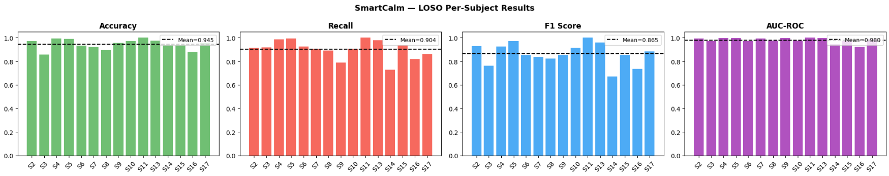
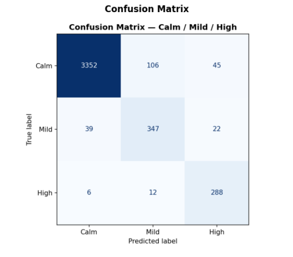
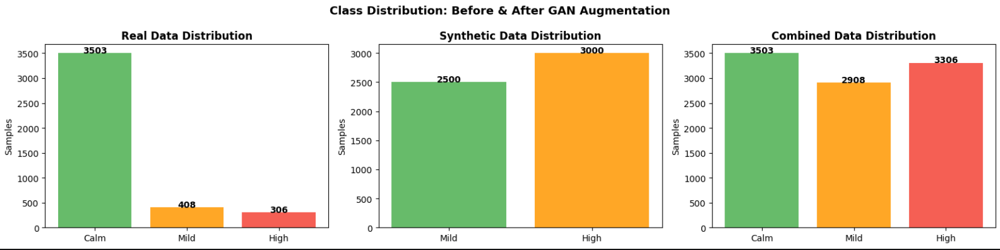

# SmartCalm — ML Model

  

The stress classification model powering SmartCalm. A Deep Residual MLP trained on physiological signals from the WESAD dataset, augmented with GAN-generated synthetic data to address class imbalance, and validated with Leave-One-Subject-Out (LOSO) cross-validation. The final model is exported to ONNX for lightweight deployment in the SmartCalm FastAPI backend.

## Pipeline Overview

All steps below run sequentially within a single notebook, `notebooks/gan-final.ipynb`:

1. **Signal segmentation** — WESAD wrist signals (EDA, BVP, TEMP, ACC) are split into 10-second windows with 50% overlap.
2. **Feature extraction** — ~81 statistical and domain-specific features per window (mean/std/skew/kurtosis, EDA SCR peak detection, BVP-derived heart rate variability metrics, etc.).
3. **3-class labeling** — WESAD's binary stress label is refined into **Calm / Mild / High** using a derived Physiological Intensity Score, splitting the "stress" class by severity.
4. **GAN augmentation** — a conditional feature-level GAN (TensorFlow) is trained per minority class (Mild, High) to generate synthetic samples and balance the dataset. Synthetic data quality is statistically validated (see Results).
5. **Model training (LOSO)** — a PyTorch **Deep Residual MLP** (3 residual blocks, BatchNorm + Dropout) is trained per subject using Leave-One-Subject-Out cross-validation: train on all other subjects' real data + all synthetic data, test on the held-out subject's real data only.
6. **Export** — the best-performing model is exported to ONNX for fast, dependency-light inference in the backend.

## Model Architecture

`SmartCalmMLP`: input projection → 3× residual blocks (Linear → BatchNorm → ReLU → Dropout, with skip connections) → classification head (3 classes: Calm/Mild/High).

## Results

**LOSO Per-Subject Performance** (mean across 15 subjects):



Mean accuracy: 94.5% · Mean recall: 90.4% · Mean F1: 86.5% · Mean AUC-ROC: 98.0% — all evaluated on **real data only** (synthetic data was used for training augmentation, never for testing).

**Confusion Matrix:**



Most confusion occurs between Calm and Mild; High-stress samples are rarely misclassified.

**Class Distribution — Real vs. Synthetic vs. Combined:**



The real WESAD data is heavily imbalanced (Calm: 3,503 · Mild: 408 · High: 306), motivating the GAN-based augmentation to generate additional Mild/High samples for training.

**GAN Synthetic Data Quality Validation:** *(pending — image not yet added)*

Synthetic data was evaluated against real data using aggregate mean/std comparison, per-feature Kolmogorov-Smirnov testing, and correlation-structure similarity. Aggregate statistics (mean/std) were closely matched between real and synthetic distributions; per-feature KS tests and correlation structure showed more variance, indicating the synthetic data approximates but does not perfectly replicate the real signal distribution. Since evaluation was performed on real data only, this did not inflate the reported accuracy above.

Full per-subject metrics will be linked here once `loso_results.csv` is added.

## Repository Structure

```
ml-model/
├─ README.md
├─ notebooks/
│  └─ gan-final.ipynb                   — full pipeline: data prep, GAN training,
│                                          LOSO MLP training, ONNX export,
│                                          results report, GAN quality evaluation
├─ models/
│  └─ mlp_scaler.pkl                    — feature scaler used at inference
│ 
└─ results/
   ├─ confusion_matrix.png
   ├─ loso_metrics.png
   └─ class_distribution.png

```

## Notes on Reproducibility

- Notebooks were developed and run on **Kaggle**, and reference Kaggle-specific paths (`/kaggle/input/...`, `/kaggle/working/...`). To run locally, update `WESAD_PATH` and output paths accordingly.
- The WESAD dataset is not included in this repository — download it from [the official WESAD source](https://ubicomp.eti.uni-siegen.de/home/datasets/icmi18/) and place it locally before running the training pipeline.
- Intermediate datasets (`real_data.csv`, `synthetic_data.csv`, `combined_data.csv`) are regenerated by running the training pipeline notebook — they are not stored in this repository.

## Requirements

- torch
- tensorflow, keras
- scikit-learn
- numpy, pandas, scipy
- matplotlib
- joblib
